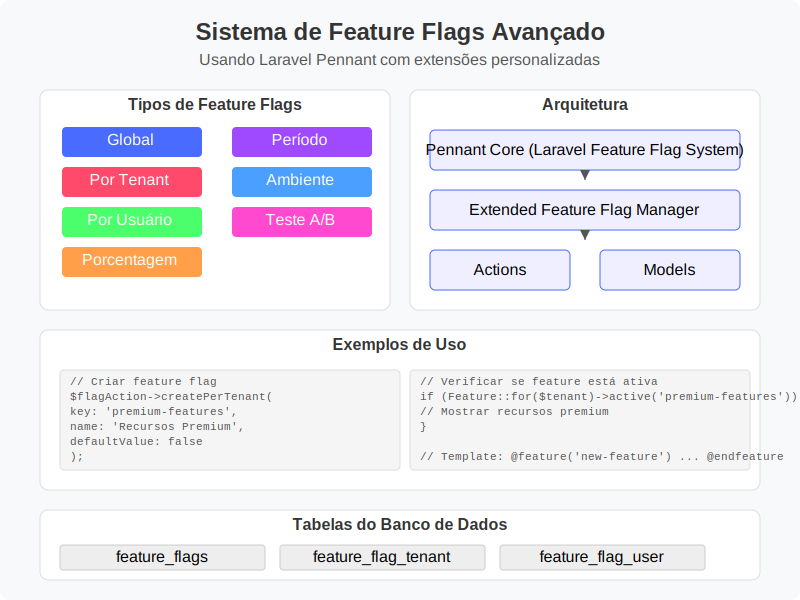

# Sistema de Feature Flags



## Visão Geral

O sistema de feature flags implementado neste projeto utiliza o Laravel Pennant como base, estendendo suas funcionalidades para fornecer um sistema mais completo e flexível. Este sistema permite habilitar e desabilitar recursos de forma granular, com suporte a diferentes tipos de flags e escopos.

> **Importante**: Esta implementação utiliza o pacote Laravel Pennant como mecanismo principal de gerenciamento de features, seguindo as práticas recomendadas para sua integração.

## Tipos de Feature Flags

O sistema suporta os seguintes tipos de feature flags:

### 1. Global

- **Descrição**: Afeta todo o sistema independentemente de usuário ou tenant.
- **Uso típico**: Recursos em desenvolvimento ou em rollout completo.
- **Valor**: Booleano (ativo/inativo).

### 2. Por Tenant (Per Tenant)

- **Descrição**: Pode ser ativado/desativado para tenants específicos.
- **Uso típico**: Recursos específicos para certos planos ou clientes.
- **Valor**: Booleano por tenant.
- **Expiração**: Suporte a data de expiração.

### 3. Por Usuário (Per User)

- **Descrição**: Pode ser ativado/desativado para usuários específicos.
- **Uso típico**: Testes com usuários beta, acesso antecipado.
- **Valor**: Booleano por usuário.
- **Expiração**: Suporte a data de expiração.

### 4. Porcentagem (Percentage)

- **Descrição**: Ativado para uma porcentagem específica de usuários/tenants.
- **Uso típico**: Rollout gradual de recursos.
- **Parâmetros**: Porcentagem (0-100%).
- **Funcionamento**: Usa hash determinístico para garantir consistência entre requisições.

### 5. Período (Date Range)

- **Descrição**: Ativo apenas durante um período específico.
- **Uso típico**: Recursos sazonais, promoções.
- **Parâmetros**: Data de início (opcional) e fim (opcional).

### 6. Ambiente (Environment)

- **Descrição**: Ativo apenas em ambientes específicos.
- **Uso típico**: Recursos em desenvolvimento ou staging.
- **Parâmetros**: Lista de ambientes (dev, staging, production, etc).

### 7. Teste A/B (AB Test)

- **Descrição**: Usado para testes A/B ou multivariantes.
- **Uso típico**: Testar diferentes versões de funcionalidades.
- **Parâmetros**: Variantes com pesos, variante padrão.
- **Valor retornado**: String indicando a variante.

## Estrutura do Banco de Dados

O sistema utiliza as seguintes tabelas:

### 1. `feature_flag_metadata`

Armazena as definições das feature flags:

```sql
CREATE TABLE feature_flag_metadata (
    id CHAR(26) PRIMARY KEY, -- ULID for better sorting and distribution
    feature_name VARCHAR(255) UNIQUE,
    display_name VARCHAR(255),
    description TEXT NULL,
    type VARCHAR(255),
    parameters JSON NULL,
    default_value BOOLEAN DEFAULT FALSE,
    is_active BOOLEAN DEFAULT TRUE,
    starts_at TIMESTAMP NULL,
    ends_at TIMESTAMP NULL,
    created_at TIMESTAMP,
    updated_at TIMESTAMP
);
```

### 2. `feature_flag_tenant`

Relacionamento com configurações específicas por tenant:

```sql
CREATE TABLE feature_flag_tenant (
    feature_name VARCHAR(255),
    tenant_id CHAR(26),
    value BOOLEAN DEFAULT FALSE,
    expires_at TIMESTAMP NULL,
    created_at TIMESTAMP,
    updated_at TIMESTAMP,
    PRIMARY KEY (feature_name, tenant_id),
    FOREIGN KEY (feature_name) REFERENCES feature_flag_metadata(feature_name) ON DELETE CASCADE,
    FOREIGN KEY (tenant_id) REFERENCES tenants(id) ON DELETE CASCADE
);
```

### 3. `feature_flag_user`

Relacionamento com configurações específicas por usuário:

```sql
CREATE TABLE feature_flag_user (
    feature_name VARCHAR(255),
    user_id CHAR(26),
    value BOOLEAN DEFAULT FALSE,
    expires_at TIMESTAMP NULL,
    created_at TIMESTAMP,
    updated_at TIMESTAMP,
    PRIMARY KEY (feature_name, user_id),
    FOREIGN KEY (feature_name) REFERENCES feature_flag_metadata(feature_name) ON DELETE CASCADE,
    FOREIGN KEY (user_id) REFERENCES users(id) ON DELETE CASCADE
);
```

## Componentes Principais

### 1. Enums

- `FeatureFlagType`: Define os tipos de feature flags disponíveis.

### 2. Models

- `FeatureFlag`: Modelo principal com relacionamentos e métodos auxiliares.
- Relacionamentos em `User` e `Tenant` para acesso às flags específicas.

### 3. Service Provider

- `FeatureFlagServiceProvider`: Registra o serviço e inicializa as features.
- Configura a resolução de escopos (tenants e usuários) automaticamente.

### 4. Services

- `FeatureFlagManager`: Gerencia o registro e atualização das feature flags no Pennant.

### 5. Actions

- `CreateFeatureFlagAction`: Cria diferentes tipos de feature flags.
- `ToggleFeatureFlagAction`: Ativa/desativa feature flags para diferentes escopos.

## Uso

### 1. Criação de Feature Flags

```php
use App\Actions\FeatureFlags\CreateFeatureFlagAction;

// Criar flag global
app(CreateFeatureFlagAction::class)->createGlobal(
    'new-dashboard', // feature name
    'Novo Dashboard', // display name
    'Nova versão do dashboard com UI redesenhada', // description
    false, // default value
    true // is active
);

// Criar flag por tenant
app(CreateFeatureFlagAction::class)->createPerTenant(
    'advanced-analytics', 
    'Analytics Avançado',
    'Recursos avançados de analytics'
);

// Criar flag por porcentagem
app(CreateFeatureFlagAction::class)->createPercentage(
    'new-editor',
    'Novo Editor de Texto',
    25, // 25% dos usuários
    'Interface de edição aprimorada'
);

// Criar flag por período
app(CreateFeatureFlagAction::class)->createDateRange(
    'holiday-theme',
    'Tema de Natal',
    now(), // starts_at
    now()->addWeeks(2), // ends_at
    'Tema especial para o período natalino'
);

// Criar flag A/B Test
app(CreateFeatureFlagAction::class)->createABTest(
    'button-color',
    'Teste de Cor do Botão',
    [
        'blue' => 0.33,
        'green' => 0.33,
        'red' => 0.34
    ],
    'blue', // default variant
    'Teste para determinar a melhor cor para botões de CTA'
);
```

### 2. Verificação de Feature Flags

```php
// Verificar se uma feature está ativa globalmente
if (Feature::active('new-dashboard')) {
    // Mostrar novo dashboard
}

// Verificar para um tenant específico
if (Feature::for($tenant)->active('advanced-analytics')) {
    // Mostrar analytics avançados
}

// Verificar para um usuário específico
if (Feature::for($user)->active('new-editor')) {
    // Mostrar novo editor
}

// Obter valor de teste A/B
$variant = Feature::for($user)->value('button-color');
// $variant pode ser 'blue', 'green', etc.
```

### 3. Ativação/Desativação Dinâmica

```php
use App\Actions\FeatureFlags\ToggleFeatureFlagAction;

// Ativar globalmente
app(ToggleFeatureFlagAction::class)->toggleGlobal('new-dashboard', true);

// Ativar para um tenant específico com expiração
app(ToggleFeatureFlagAction::class)->toggleForTenant(
    'advanced-analytics',
    $tenant,
    true,
    now()->addDays(30) // Expira em 30 dias
);

// Ativar para um usuário específico
app(ToggleFeatureFlagAction::class)->toggleForUser('new-editor', $user, true);

// Atualizar porcentagem de rollout
app(ToggleFeatureFlagAction::class)->updatePercentage('new-editor', 50); // 50% dos usuários

// Atualizar período de atividade
app(ToggleFeatureFlagAction::class)->updateDateRange(
    'holiday-theme',
    now()->subDay(), // starts_at
    now()->addMonth() // ends_at
);

// Atualizar variantes de teste A/B
app(ToggleFeatureFlagAction::class)->updateABTest(
    'button-color',
    [
        'blue' => 0.5,
        'green' => 0.5,
        'red' => 0.0 // Removendo a variante vermelha
    ],
    'green' // novo default
);
```

### 4. Em Controladores de API

```php
// Em qualquer controlador ou middleware
public function index(Request $request)
{
    // Verificar feature globalmente
    if (Feature::active('new-dashboard')) {
        // Retornar dados do novo dashboard
        return $this->newDashboardData();
    }
    
    // Retornar dados do dashboard padrão
    return $this->standardDashboardData();
}

// Verificação específica por tenant
public function reports(Request $request, Tenant $tenant)
{
    // Verificar se o tenant tem acesso aos relatórios premium
    if (Feature::for($tenant)->active('premium-reports')) {
        return $this->premiumReports($tenant);
    }
    
    return $this->standardReports($tenant);
}

// Uso em middlewares
public class FeatureGate
{
    public function handle($request, $next, $feature)
    {
        // Verificar se a feature está ativa para o tenant atual
        if (!Feature::active($feature)) {
            return response()->json([
                'error' => 'Feature not available',
                'feature' => $feature
            ], 403);
        }
        
        return $next($request);
    }
}
```

## Cache e Performance

O sistema utiliza cache para melhorar a performance:

- As verificações de feature flags são cacheadas por 30 minutos.
- O cache é limpo automaticamente quando uma feature flag é atualizada.
- Suporte a invalidação seletiva de cache.

## Integração com Sistema de Planos

O sistema de feature flags se integra com o sistema de planos (PlanType) para:

- Ativar automaticamente flags específicas para certos planos.
- Fornecer diferentes conjuntos de funcionalidades baseados no plano.

## Testes

O sistema inclui ferramentas para facilitar testes:

```php
// Em testes de feature
Feature::define('new-dashboard', true);

// Ou para um escopo específico
Feature::for($tenant)->define('advanced-analytics', true);
```

## Monitoramento

O sistema registra eventos para:

- Criação de feature flags
- Ativação/desativação de flags
- Erros de configuração

Esses logs podem ser usados para monitoramento e auditoria.

## Próximos Passos

1. **Interface Administrativa**
   - Implementar dashboard para gerenciar feature flags
   - Visualização em tempo real do status de cada flag
   - Historial de ativação/desativação

2. **Métricas e Analytics**
   - Rastreamento de uso para cada feature flag
   - Análise de impacto de recursos por tenant/usuário
   - Dashboard para visualização de resultados de testes A/B

3. **Expansão de Funcionalidades**
   - Suporte para feature flags com valores complexos (além de booleanos)
   - Feature flags baseadas em regras de negócio complexas
   - Integração com sistemas externos de feature flagging

4. **Integrações**
   - Webhooks para notificações sobre mudanças em flags
   - Integração com ferramentas de monitoramento
   - Exportação/importação de configurações

5. **Segurança e Permissões**
   - Controle granular de quem pode gerenciar quais flags
   - Auditoria detalhada de alterações
   - Proteção contra alterações não autorizadas de flags críticas